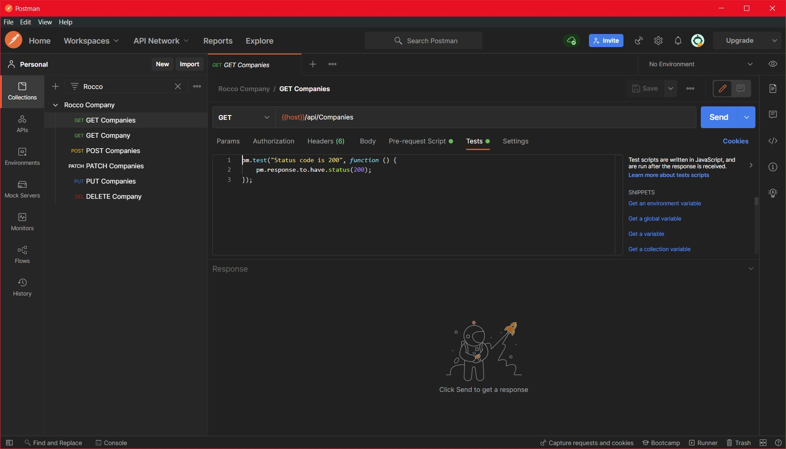

 

 


<!-- PROJECT LOGO -->
<br />
<div align="center">
  <a href="https://github.com/helibertoarias/Rocco">
    
  </a>

  <h3 align="center"Rocco Web API</h3>
 


</div>
<!-- TABLE OF CONTENTS -->
<details>
  <summary>Table of Contents</summary>
  <ol>
    <li>
      <a href="#about-the-project">About The Project</a>
      <ul>
        <li><a href="#built-with">Built With</a></li>
      </ul>
    </li>
    <li>
      <a href="#getting-started">Getting Started</a>
      <ul>
        <li><a href="#prerequisites">Prerequisites</a></li>
        <li><a href="#installation">Installation</a></li>
      </ul>
    </li>
    <li><a href="#usage">Usage</a></li>
    <li><a href="#contact">Contact</a></li>
   
  </ol>
</details>


<!-- ABOUT THE PROJECT -->
## About The Project

This is a Web API for handling basic information in the Rocco company.

<p align="right">(<a href="#top">back to top</a>)</p>


### Built With

This Web API has build using ASP.NET Core Web API using .NET 6.0.  

Some of the Nuget Packages used here are:

- Entity Framework Core for SQL Server
- Autommaper
- Serilog
- Fluent Validation
- Newtonsoft
- Swashbuckle
 
<p align="right">(<a href="#top">back to top</a>)</p>


<!-- GETTING STARTED -->
## Getting Started

Here some steps to run the application

### Prerequisites

- Visual Studio 2020 
- SDK .NET 6
- SQL Server Express 2019 or other version will works.

### Installation

_To start using the application you should._

1. Clone the repo.
   ```sh
   git clone https://github.com/helibertoarias/Rocco.git
   ```
2. Open the solution Rocco.sln and build to restore the Nuget Packages.
3. Set the project Rocco.Web.API as startup project.
4. Open the file ./Rocco.Web.API/appsettings.json and update the user and password.
    ```json
    "ConnectionStrings": {
      "RoccoConnectionString": "Server=localhost;Database=Rocco;User Id=<user>;Password=<password>" 
       
     ```
5. In VS 2020 open a new terminal and create the database for the application and the users.
    ```cmd
    Update-Database -Context RoccoContext
     ```
6. After this you can run the application. The Swagger page will show up
 [https://localhost:36000/swagger/index.html](https://localhost:36000/swagger/index.html)
7. To validate the Web API you need to import the file *Rocco Company.postman_collection* into [POSTMAN](https://www.postman.com/downloads/) and run the test collection. Here some screenshots.

    
    - Select the imported file and hit the *Run* button.

    <br />
   
  <br />


 
        - After a seconds you should the test result all passed.

   <br />
   

8. An extra end point was added in order to provide a random number from an external web service. You can access from this URL [https://localhost:7098/api/Random/getrandom](https://localhost:7098/api/Random/getrandom)
 
<p align="right">(<a href="#top">back to top</a>)</p>


<!-- USAGE EXAMPLES -->
## Usage

Use this space to show useful examples of how a project can be used. Additional screenshots, code examples and demos work well in this space. You may also link to more resources.

_For more examples, please refer to the [Documentation](https://example.com)_

<p align="right">(<a href="#top">back to top</a>)</p>


 
 

 


<!-- CONTACT -->
## Contact

Heliberto Arias - [@helibertoarias](https://twitter.com/helibertoarias) - helibertoarias@gmail.com

Project Link: [https://github.com/helibertoarias/RoccoSolution](https://github.com/helibertoarias/RoccoSolution)

<p align="right">(<a href="#top">back to top</a>)</p>


 
